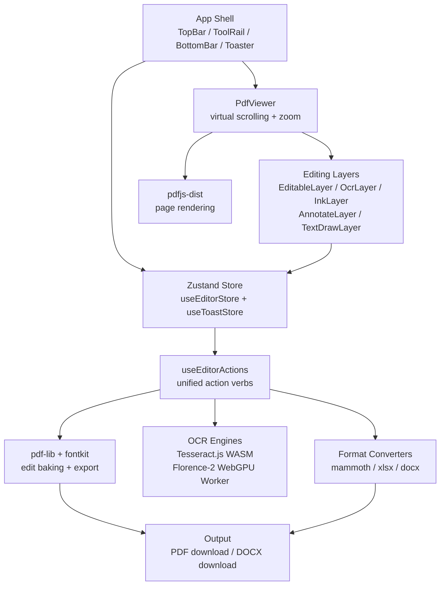
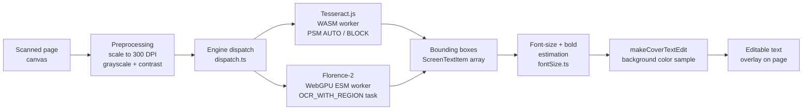

# pdf-editor

**A fully client-side PDF editor — no uploads, no server, no compromises.**

    

Every file you open stays on your machine. pdf-editor runs entirely in the browser — no backend, no cloud storage, no uploads. Open a PDF (or a Word doc, spreadsheet, or image), annotate it, OCR scanned pages with either a WASM Tesseract engine or a WebGPU-accelerated Florence-2 vision model, reorganize pages, and export a clean PDF — all without leaving the tab.

---

## Features

### Viewing

- Multi-page PDF rendering via `pdfjs-dist` with virtual scrolling (only visible pages + 3 overscan pages are mounted)
- CSS-transform zoom: fit-width, fit-page, discrete presets (50 %–400 %), pinch-to-zoom, and `Cmd`+`-`/`+`/`0`
- Top-bar page-jump widget (type a number, press `Enter`, or use chevrons)
- Whole-window drag-and-drop to open a file from anywhere

### Editing

- **Edit existing text** — click any text on the page to lift it into a rich-text editor; original glyphs are hidden under a background-sampled cover rectangle
- **Add text boxes** — drag to draw a box (or click for a default size); immediately focused for typing
- **Rich-text formatting** — per-run bold, italic, color, font size (8–64 px), text alignment, and font family (3 built-in PDF fonts + ~150 searchable Google Fonts with live CSS loading and subsetting on export)
- **Replace images** — click any embedded PDF image to swap it with a PNG or JPEG from disk
- **Add images** — drag-and-drop or file-picker; placed as a draggable/resizable overlay
- **Freehand ink drawing** — pointer/stylus strokes stored as polylines
- **Markup annotations** — highlight (yellow), underline (red), and strikeout bands
- **Sticky-note comments** — click to pin; hover/click to expand and type
- **Rectangle overlays** — whitebox covers or decorative shapes
- **Signatures** — draw freehand on a canvas or type a name in cursive; embedded as a transparent PNG

### OCR & Text Recovery

- **Standard OCR** — Tesseract.js 5 (WASM), always available; preprocesses canvases at up to 300 DPI with Sauvola local binarization and grayscale + contrast boost
- **AI OCR** — Florence-2-base-ft (`onnx-community/Florence-2-base-ft`) via `@huggingface/transformers` on WebGPU; ~275 MB model downloaded once and cached by the browser
- **Three scopes** — drag to select a region, OCR the current page, or OCR all pages at once with a live page counter and Cancel button
- Automatic font-size estimation, bold/heading detection, list-item extraction, hyphenation repair, and background-color sampling per recognized block
- All OCR boxes are fully editable, draggable, and resizable like any other overlay

### Documents & Conversion

- **Export PDF** — bakes all edits, rotations, crops, and page reorders into a new PDF using `pdf-lib`, with custom Google Font embedding
- **Compress PDF** — re-encodes all pages as downsampled JPEG (max 1240 px, quality 0.7) and rebuilds a flat PDF
- **Export DOCX** — classifies text edits as headings, bullet-list items, or body paragraphs; generates a formatted `.docx` via the `docx` library (fully client-side)
- **Merge PDFs** — combine multiple files into one document
- **Split PDF** — specify page ranges (e.g. `1-3,5,8-10`) or split into individual pages; each part downloads separately
- **Convert to PDF** — Word `.docx` (via `mammoth`), Excel `.xlsx/.xls/.csv` (via `xlsx`), and PNG/JPEG images all convert to PDF in-browser

### Productivity

- **Undo/Redo** — snapshot-based history (up to 100 steps); burst-coalesces rapid typing and nudge into a single entry (`Cmd+Z` / `Cmd+Shift+Z`)
- **Command palette** (`Cmd+K`) — searchable list of every action, grouped by File / Mode / Add / Annotate / Pages / View / Export
- **Find in page** (`Cmd+F`) — searches across all text overlays; `Enter`/`Shift+Enter` to step through matches
- **Page organizer** — thumbnail sidebar with drag-and-drop reorder, Alt+Arrow keyboard reorder, per-page delete
- **Per-page actions** — rotate CCW/CW, draw-to-crop with confirm checkmark, reset transforms, delete page
- **Full keyboard shortcuts** — `V E T H U C D` for tool modes; arrow keys to nudge (1 px; 10 px with Shift); `Delete` to remove; `W P` for fit modes
- **Unsaved-changes guard** — browser prompts before navigating away if there are pending edits

---

## Architecture



---

## OCR Pipeline



> **Key insight:** all coordinates are stored in 800 px screen space (`VIEWER_WIDTH`). The OCR pipeline, the editor, and the PDF export pipeline all operate in this common space — no coordinate-system juggling between recognition and display.

---

## Tech Stack

| Layer              | Technology                                 | Purpose                                                   |
| ------------------ | ------------------------------------------ | --------------------------------------------------------- |
| UI framework       | React 19 + TypeScript 6                    | Component tree, hooks, strict mode                        |
| Build tool         | Vite via `@voidzero-dev/vite-plus-core`    | Dev server, ESM workers, GitHub Pages output              |
| State              | Zustand 5                                  | Editor store + toast store; snapshot undo/redo            |
| PDF rendering      | `pdfjs-dist` 5.4.296 + `react-pdf` 10      | Canvas-based page rasterization; text/image extraction    |
| PDF mutation       | `pdf-lib` + `@pdf-lib/fontkit`             | Edit baking, rotation, crop, merge, split, font embedding |
| OCR (WASM)         | `tesseract.js` 5                           | Offline Tesseract LSTM in a reusable singleton worker     |
| OCR (AI)           | `@huggingface/transformers` 4 (Florence-2) | In-browser VLM on WebGPU; quad bounding boxes             |
| Drag/resize        | `react-rnd`                                | All overlay drag and resize handles                       |
| Virtual scroll     | `@tanstack/react-virtual`                  | Window-mount only visible PDF pages                       |
| Word import        | `mammoth`                                  | `.docx` → raw text for PDF conversion                     |
| Spreadsheet import | `xlsx`                                     | `.xlsx/.xls/.csv` → text for PDF conversion               |
| Word export        | `docx`                                     | Text edits → formatted `.docx` download                   |
| Icons              | `lucide-react`                             | Consistent icon set throughout the UI                     |
| Fonts              | Google Fonts (runtime fetch)               | ~150 families; subset-embedded in exported PDFs           |

---

## Getting Started

### Prerequisites

- **Node.js** 20+
- **pnpm** 11.5.2 (`corepack enable` or `npm i -g pnpm`)

### Install

```bash
pnpm install
```

> The `predev` and `prebuild` hooks automatically run `sync-pdf-wasm`, which copies `openjpeg.wasm` and `qcms_bg.wasm` from `pdfjs-dist` into `public/wasm/`. JPEG2000-encoded PDFs will render correctly without any manual step.

### Development

```bash
pnpm dev       # vp dev — starts Vite dev server
```

### Production build

```bash
pnpm build     # tsc && vp build
pnpm preview   # vp preview
```

### Lint / format

```bash
pnpm lint
pnpm format
```

### Tests

```bash
pnpm test      # vp test (Vitest)
```

---

## Project Structure

```
src/
├── components/          # React UI components
│   ├── PdfViewer.tsx    # Virtualised page renderer + OCR orchestration
│   ├── EditableLayer.tsx
│   ├── OcrLayer.tsx / OcrMenu.tsx
│   ├── ToolRail.tsx / RailButton.tsx
│   ├── TopBar.tsx / BottomBar.tsx
│   ├── CommandPalette.tsx / FindBar.tsx
│   ├── SignatureModal.tsx / SplitDialog.tsx
│   └── ...
├── store/
│   ├── useEditorStore.ts   # Document model, edit history, OCR state
│   └── useToastStore.ts    # Toast notifications
├── hooks/
│   ├── useEditorActions.ts # Stable action layer shared by toolbar + palette
│   ├── usePageHeights.ts
│   └── useFocusTrap.ts
├── lib/
│   ├── exportPdf.ts        # pdf-lib edit baking, compress, merge, split
│   ├── exportDocx.ts       # docx export
│   ├── convertToPdf.ts     # mammoth / xlsx / image → PDF
│   ├── ocr.ts              # Tesseract.js engine
│   ├── vlmOcr/             # Florence-2 WebGPU engine + dispatch
│   ├── textLayer.ts        # pdfjs text extraction + background sampling
│   ├── imageLayer.ts       # pdfjs image extraction
│   ├── pdfGeometry.ts      # VIEWER_WIDTH, coordinate mapping
│   ├── fonts.ts            # Google Fonts catalog + CSS injection
│   └── richText.ts         # TextRun normalization, selection formatting
└── styles.css              # OKLCH design tokens, monochrome chrome
```

---

## Testing

Tests are run with **Vitest** via the `vp test` alias:

```bash
pnpm test
```

Unit tests cover coordinate projection (`projection.test.ts`) and font-size estimation (`fontSize.test.ts`) in `src/lib/vlmOcr/`. The test environment stubs canvas APIs so OCR unit tests run without a real GPU or WASM binary.

---

## Contributing

1. Fork the repo and create a branch from `main`.
2. Run `pnpm install && pnpm dev`.
3. Make your changes; ensure `pnpm lint` and `pnpm test` pass.
4. Open a pull request with a clear description of what changed and why.

All edits are stored as plain TypeScript objects in the Zustand store — adding a new edit type means extending the `PdfEdit` union, a factory helper in `useEditorStore.ts`, a renderer in `EditableLayer.tsx`, and a bake step in `exportPdf.ts`.

---

## Support

If pdf-editor is useful to you, consider supporting its development:

<a href="https://www.buymeacoffee.com/willyanfx" target="_blank"></a>

---

## License

See [LICENSE](./LICENSE) for details.
